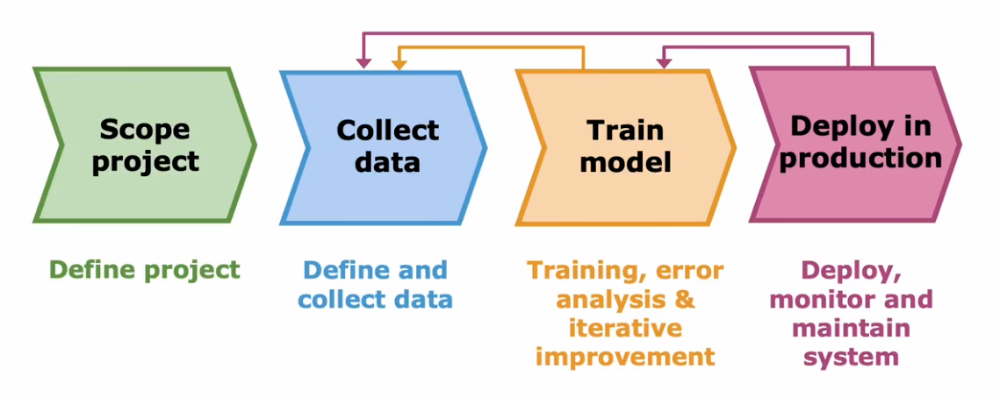

# Machine Learning Development Process

## Error analysis

> Manually examine error examples and categorize them base on common features.  
> Focus your attention on the more promising things to try.

_e.g._ $m_{cv}=500$ examples in cross validation set.  
Algorithm misclassifies 100 of them.  
Manually examine and categorize them:

1. Pharma: 14
2. Deliberate misspellings: 3
3. Unusual emain routing: 8
4. Steal password (fishing): 18
5. Spam message in embedded image: 5
   > Focus on 1 and 4 is more hopeful.

## Adding data

> Tips for adding, collecting, or creating more data.

- **Data augmentation**

  > turn one training example into more.

  For `images`: rotating, enlarging, shrinking, changing the contrast, taking the mirror image, or placing on a grid and warping it.  
  For `audio data`: adding noisy background (_e.g._ crowd, car), aduioing on bad cellphone connection.

- **Data synthesis**

  > using artificial data inputs to create a new training example.

  Used most for computer vision taks.  
  _e.g._ In OCR, you can type ouut random text using different fonts, weights, and colors in a editor and screenshot it.

## Transfer learning

> Use data from a different task to help on your application.

Two steps of first training on a large data set and then turning the parameters futher on a smaller data set.

1. `supervised pre-training`: Download neural network parameters pretrained on a large dataset with same input type (_e.g._ images, audio, text) as your application, or train your own.
2. `fine tuning`: Further train the network on your own data.

_e.g._ Recoginizing handwriten digits

1. Without much data.
2. There is a very large dat set of pictures of cats, dogs, cars, and so on.

You can start by training a neural network on this large data set.  
In this process, you end up learning parameters for each hidden layer.  
_Applying transfer learning_: make a copy of this neural network where you would keep the parameters of hidden layers and replace the output layer with a smaller one.  
Here are two options:

- only traing output layers parameters. (better for small training set)
- train all parameters.

## Precision and recall (Optional)

> For detecting skewed classes or a rare class

_e.g._ binary classification

|                         |                        |
| ----------------------- | ---------------------- |
| True positive   15  | False positive   5 |
| False negative   10 | True negative   70 |

**Precision:**
$$ \frac{\text{True positives}}{\text{\#predicted positives}} = \frac{\text{True positives}}{\text{True positives} + \text{False positives}} $$

**Recall:**
$$\frac{\text{True positives}}{\text{\#actual positives}} = \frac{\text{True positives}}{\text{True positives} + \text{False negatives}} $$

- How to trade off?  
   choose a higher threshold (_0.7_) rather than a common threshold (_0.5_). Result **higher** precision, but **lower** recall.

  choose a lower threshold (_0.3_).  
   Result **lower** precision, but **higher** recall.

  So, plotting precision and recall for different value of threshold allows you to pick a point that you want.Result **higher** precision, but **lower** recall.

  `F1 score`: $$ \text{F1 score} = \frac{1}{\frac{1}{2} (\frac{1}{P}+\frac{1}{R})} = 2\frac{PR}{P+R} $$ help you to choose one of several algorithms

## Full cycle

